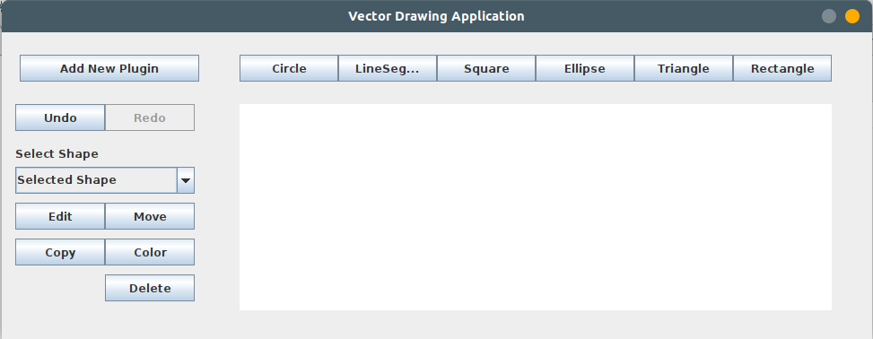
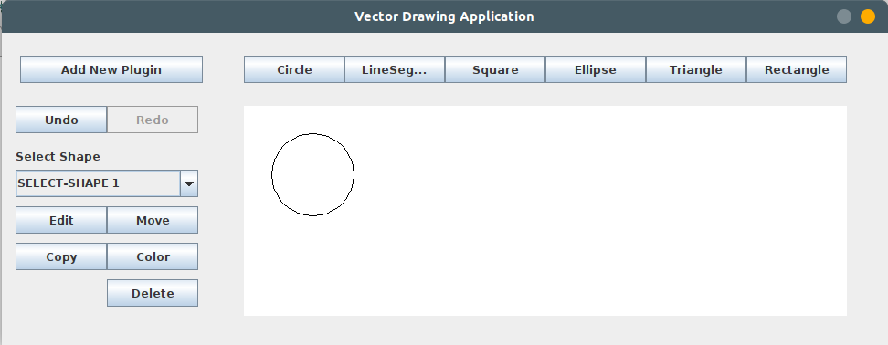
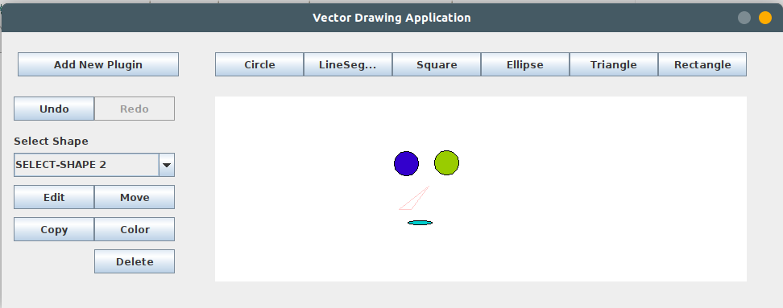

# Vector Based Drawing Application 

Objectives

- Design an object oriented model for geometric shapes
- Draw a UML class diagram that represents your model
- Apply the OOP concepts of inheritance and polymorphism to your design
- Create an advanced GUI with 2D Graphics capabilities
- Enable dynamic extensions to your applications

Part 1: Geometric Shapes Data Model

Description:

Geometric shapes belong to different groups (ex: Elliptical Shapes, Polygons,
Sectors…etc). Members of these different groups are related to each other in the
sense that they share common properties. In order to be able to implement an
efficient and object oriented drawing application. It is essential to design a model
that takes these relations into consideration.

Tasks:

1- Design an object oriented model that covers the following geometric shapes: Line
Segment, Circle, Ellipse, Triangle, Rectangle and Square.
2- Draw a UML Class diagram that represents your model, showing all the classes,
attributes and methods.
3- Apply the concepts of inheritance and polymorphism to your design.

Part 2: Drawing and Painting Application

Description:

Drawing and painting applications are very popular and have a huge user base.
They generally offer a big number of features that includes but is not limited to:
Drawing, Coloring, and Resizing. They also include a number of built in, and
possibly extensible set of geometric shapes, and classically, they allow the user to
undo or redo any instructions so as to make the application more usable

Tasks:

1- Implement your design from part 1 in Java.
2- Design and implement a GUI that allows the drawing functionalities for the user
on all the shapes defined in part 1.
3- There is no need to use the cursor in drawing. Just use a set of buttons to select
the shape. Upon pressing the button, a dialog box appears to enter the
properties of the shape such as: position, radius, length, …, etc. 
4- In order to support the operations of edit, move, copy, colorize and delete a
shape, there should be a way to select the shape. Add a drop-down menu that
shows all the drawn shapes. You can use any arbitrary names for the drawn
shapes (For example: circle01, square_04, …, etc). That way, the user can select a
shape then applies an operation on it.
5- Implement your application such that it would allow the user to undo or redo any
action performed. 

Part 3: Dynamic Application Extensions and plug-ins

Description:

The concept of dynamic class loading is widely spread in computer applications. It
is an option that allows the user to extend application features at runtime. This
can be easily done by the dynamic class loading capabilities that OOP languages
offer.

Tasks:

1- Create a new kind of the Shapes rather than the ones at Part 1 (e.g. Trapezoid,
Star, Diamond, …, etc.)
2- Compile the class of the new kind as a class library (i.e. Jar file).
3- Provide an option in the GUI of your application that allows installing new shape.
The user will see a dialog that allows him to enter:
a. The fully qualified name of the shape class, and
b. The path of the class library file (i.e. Jar file).
4- On installing and loading the class library file, the new shape should be appended
to the available list of shapes in the application (use your method
addNewSupportedShape). The GUI will ask the engine to get its currently
supported list of shapes using the method getSupportedShapes, and add a new
button for drawing the new shape 

Screenshots:

